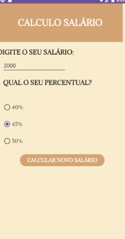

<h1>SOBRE O PROJETO:</h1>

O projeto tem como propósito intensificar a aprendizagem de java, foi feito uma calculadora específica para salário,onde é posível callcular e também imular o valor de algum salário;

<h1>TELA DO PROJETO</h1>

  

